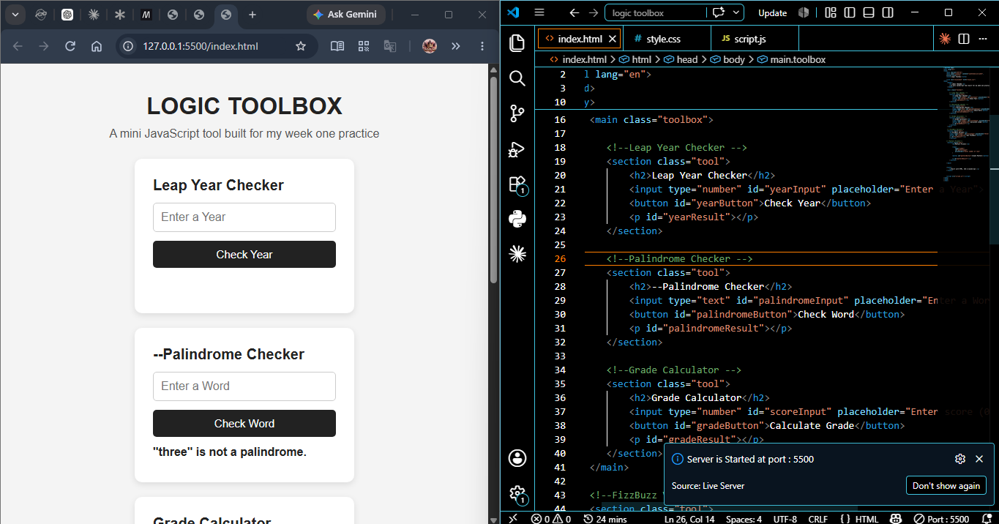

# Logic Toolbox

A single-page collection of small interactive logic tools built with vanilla JavaScript — leap year checker, palindrome checker, grade calculator, FizzBuzz variant, number pattern printer, and more.

**Live demo:** []

## What it does

Each tool takes user input, validates it (handling empty input, non-numeric input, and edge cases), and displays a result — all on one page, no frameworks or libraries.

## Skills Practised

- Conditionals (`if/else`, `switch`, ternary operators)
- Loops (`for`, `while`, nested loops)
- Functions (declarations, expressions, arrow functions)
- Scope and basic hoisting
- Basic DOM manipulation to display results
- Input validation and edge-case handling
- Reading and debugging JS error messages

## How to Run Locally

1. Clone this repo: `git clone [your-repo-url]`
2. Open `index.html` in your browser, or serve it with a local server (e.g., VS Code's Live Server extension)
3. No build step, no dependencies

## What I'd Improve Next

<!-- Fill this in honestly — e.g., "Reduce repeated validation logic across tools into a shared helper function" -->
